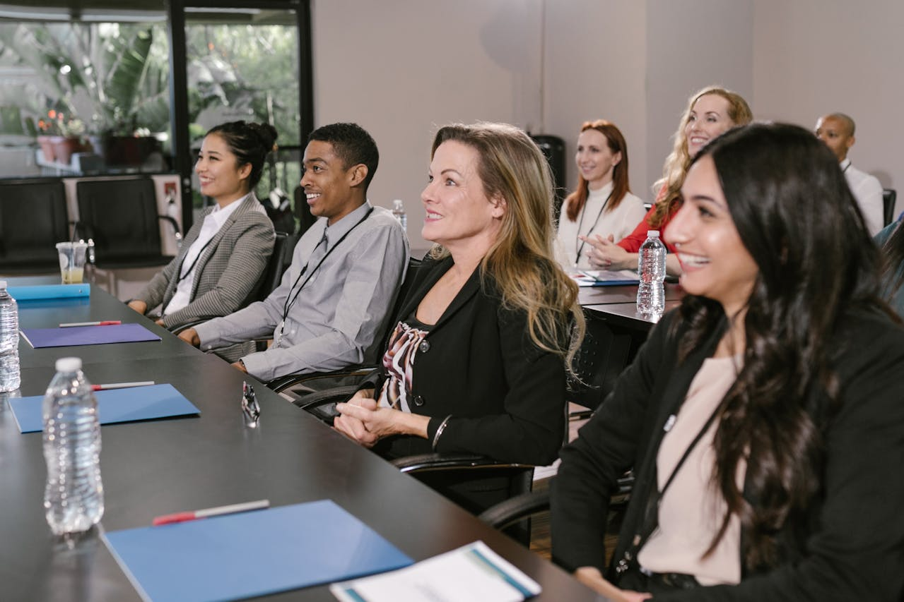

# Hackathon - Student Showcase

**Objective:** The goal of this project is to create a mobile first responsive website for Fanshawe College's upcoming Industry Night. Incorporating concepts learned in previous terms, our team created a platform to showcase student portfolios and include information about the event.

## Installation
No installation required

## Usage
Just enjoy!

## Contributing
1. Fork it!
2. Create your feature branch: `git checkout -b my-new-feature`
3. Commit your changes: `git commit -am 'Add some feature'`
4. Push to the branch: `git push origin my-new-feature`
5. Submit a pull request :D

## History

September 2024

## Credits
Dina Bondarchuk, Rodrigo Nobre do Nascimento, Jenifer Quelali Evangelista, Harnoorpreet Kaur

## License
none